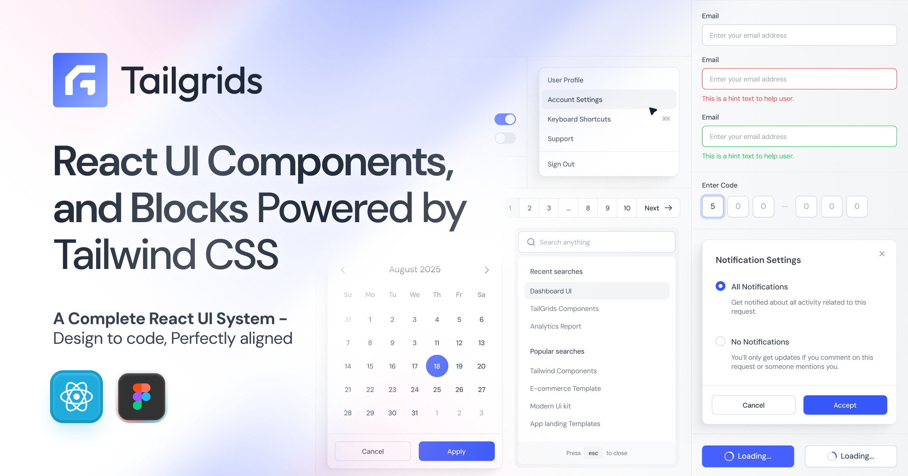

# Free React UI Components Powered by Tailwind CSS

**Tailgrids** is an open-source **React UI component library built with Tailwind CSS**. Ship modern web applications faster with an extensive collection of **100+ production-ready, fully customizable, copy-paste friendly components**, plus premium UI blocks and templates.

[](https://tailgrids.com)

All components feature a **sleek, handcrafted, pixel-perfect design** optimized for exceptional UX, high performance, accessibility (a11y), dark mode, and responsiveness.

Build human-centered websites, dashboards, SaaS products, landing pages, and internal tools — without reinventing the UI from scratch.

[](https://github.com/TailGrids/tailgrids)
[](https://github.com/TailGrids/tailgrids/blob/main/LICENSE)
[](https://tailgrids.com/docs)

---

## 📦 Quick Installation

Set up Tailgrids in your React / Next.js project in seconds.

### 1. Initialize Tailgrids

```bash
npx @tailgrids/cli@latest init
```

This creates the config, base styles, and installs required dependencies.

### 2. Add Your First Component

```bash
npx @tailgrids/cli@latest add button
```

### 3. Use It

```tsx
import { Button } from "@/components/core/button";

export default function Home() {
  return <Button variant="primary">Hello Tailgrids!</Button>;
}
```

**Full installation guide →** [Tailgrids Installation Docs](https://tailgrids.com/docs/installation)

---

## ✨ Key Features

- **100+ free React components** – Production-ready and actively expanding
- **Premium UI Blocks** – 500+ ready-to-use sections for apps, dashboards, marketing, e-commerce, and AI
- **React + TypeScript first-class support** – Fully rebuilt in v3 with clean JSX/TSX
- **Powered by Tailwind CSS** – 100% customizable with utility classes
- **Tailgrids CLI** – Instant component installation
- **Modern design tokens** + flexible theming system
- **Built-in accessibility**, dark mode, responsive design, and keyboard navigation
- **Works with Next.js, Vite, CRA**, and all major React frameworks
- **No heavy dependencies** – Lightweight and maintainable
- **Beautiful open-source SVG icon library** included

---

## 🔗 Essential Links

| Resource              | Link                                      |
|-----------------------|-------------------------------------------|
| **Website**           | [tailgrids.com](https://tailgrids.com)    |
| **Documentation**     | [tailgrids.com/docs](https://tailgrids.com/docs) |
| **All Components**    | [tailgrids.com/docs/components](https://tailgrids.com/docs/components) |
| **UI Blocks**         | [tailgrids.com/blocks](https://tailgrids.com/blocks) |
| **Templates**         | [tailgrids.com/templates](https://tailgrids.com/templates) |
| **Changelog**         | [tailgrids.com/docs/changelog](https://https://tailgrids.com/docs/changelog) |
| **GitHub Repository** | [TailGrids/tailgrids](https://github.com/TailGrids/tailgrids) |
| **CLI Documentation** | [Installation Guide](https://tailgrids.com/docs) |

---

## UI Components

**100+ free, production-ready React components** — categorized for easy browsing.

All components are fully documented with examples, API references, accessibility notes, and copy-paste code.

### Core UI Components

- **[Accordion](https://tailgrids.com/docs/components/accordion)**
- **[Alert](https://tailgrids.com/docs/components/alert)**
- **[Alert Dialog](https://tailgrids.com/docs/components/alert-dialog)**
- **[Aspect Ratio](https://tailgrids.com/docs/components/aspect-ratio)**
- **[Avatar](https://tailgrids.com/docs/components/avatar)**
- **[Badge](https://tailgrids.com/docs/components/badge)**
- **[Breadcrumbs](https://tailgrids.com/docs/components/breadcrumbs)**
- **[Button](https://tailgrids.com/docs/components/button)**
- **[Button Group](https://tailgrids.com/docs/components/button-group)**
- **[Card](https://tailgrids.com/docs/components/card)**
- **[Carousel](https://tailgrids.com/docs/components/carousel)**
- **[Chart](https://tailgrids.com/docs/components/chart)**
- **[Checkbox](https://tailgrids.com/docs/components/checkbox)**
- **[Collapsible](https://tailgrids.com/docs/components/collapsible)**
- **[Command](https://tailgrids.com/docs/components/command)**
- **[Combobox](https://tailgrids.com/docs/components/combobox)**
- **[Context Menu](https://tailgrids.com/docs/components/context-menu)**
- **[Date Picker](https://tailgrids.com/docs/components/date-picker)**
- **[Dialog](https://tailgrids.com/docs/components/dialog)**
- **[Drawer](https://tailgrids.com/docs/components/drawer)**
- **[Dropdown](https://tailgrids.com/docs/components/dropdown)**
- **[Field](https://tailgrids.com/docs/components/field)**
- **[Hover Card](https://tailgrids.com/docs/components/hover-card)**
- **[Input](https://tailgrids.com/docs/components/input)**
- **[Input Group](https://tailgrids.com/docs/components/input-group)**
- **[Label](https://tailgrids.com/docs/components/label)**
- **[Link](https://tailgrids.com/docs/components/link)**
- **[List](https://tailgrids.com/docs/components/list)**
- **[Menubar](https://tailgrids.com/docs/components/menubar)**
- **[Native Select](https://tailgrids.com/docs/components/native-select)**
- **[Navigation Menu](https://tailgrids.com/docs/components/navigation-menu)**
- **[OTP Input](https://tailgrids.com/docs/components/otp-input)**
- **[Pagination](https://tailgrids.com/docs/components/pagination)**
- **[Popover](https://tailgrids.com/docs/components/popover)**
- **[Progress](https://tailgrids.com/docs/components/progress)**
- **[Radio Input](https://tailgrids.com/docs/components/radio-input)**
- **[Resizable](https://tailgrids.com/docs/components/resizable)**
- **[Scroll Area](https://tailgrids.com/docs/components/scroll-area)**
- **[Select](https://tailgrids.com/docs/components/select)**
- **[Separator](https://tailgrids.com/docs/components/separator)**
- **[Sheet](https://tailgrids.com/docs/components/sheet)**
- **[Skeleton](https://tailgrids.com/docs/components/skeleton)**
- **[Slider](https://tailgrids.com/docs/components/slider)**
- **[Social Button](https://tailgrids.com/docs/components/social-button)**
- **[Spinner](https://tailgrids.com/docs/components/spinner)**
- **[Table](https://tailgrids.com/docs/components/table)**
- **[Tabs](https://tailgrids.com/docs/components/tabs)**
- **[Text Area](https://tailgrids.com/docs/components/text-area)**
- **[Time Picker](https://tailgrids.com/docs/components/time-picker)**
- **[Toast](https://tailgrids.com/docs/components/toast)**
- **[Toggle](https://tailgrids.com/docs/components/toggle)**
- **[Tooltip](https://tailgrids.com/docs/components/tooltip)**

**Browse the full interactive component library →** [tailgrids.com/docs/components](https://tailgrids.com/docs/components)

---

## 🧱 UI Blocks & Templates

- **UI Blocks** – Pre-built sections for dashboards, apps, marketing, e-commerce, and AI products → [Explore Blocks](https://tailgrids.com/blocks)

- **Templates** – Complete, ready-to-use React + Tailwind pages and layouts → [Browse Templates](https://tailgrids.com/templates)

---

## 🧠 Built for Developers and Designers

Tailgrids is designed for **developers and designers** who ship real products:

- Clean, readable, TypeScript-ready React code
- Enterprise-ready Figma design system (available for Pro users)
- Consistent design language across free + premium ecosystem
- Long-term maintainability and excellent developer experience

---

## 📄 License

This project is licensed under the **MIT License** — free for personal and commercial use.

See [LICENSE](https://github.com/TailGrids/tailgrids/blob/main/LICENSE) for details.

---

## ❤️ Contributing

We welcome contributions! Feel free to:
- Read [contribtion guideline](https://github.com/TailGrids/tailgrids/blob/main/CONTRIBUTING.md)
- Submit pull requests
- Share feedback on Discord or GitHub Discussions

---

**Made with ❤️ for the React Tailwind community.**

Start building faster today → [Get Started](https://tailgrids.com/docs)
